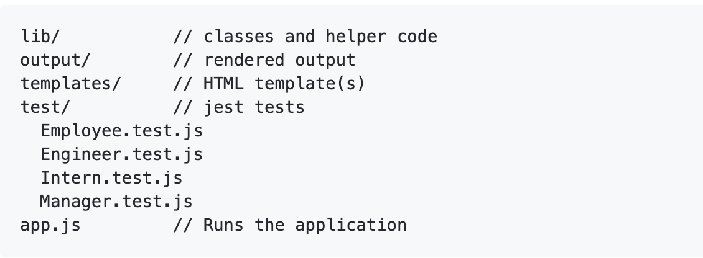
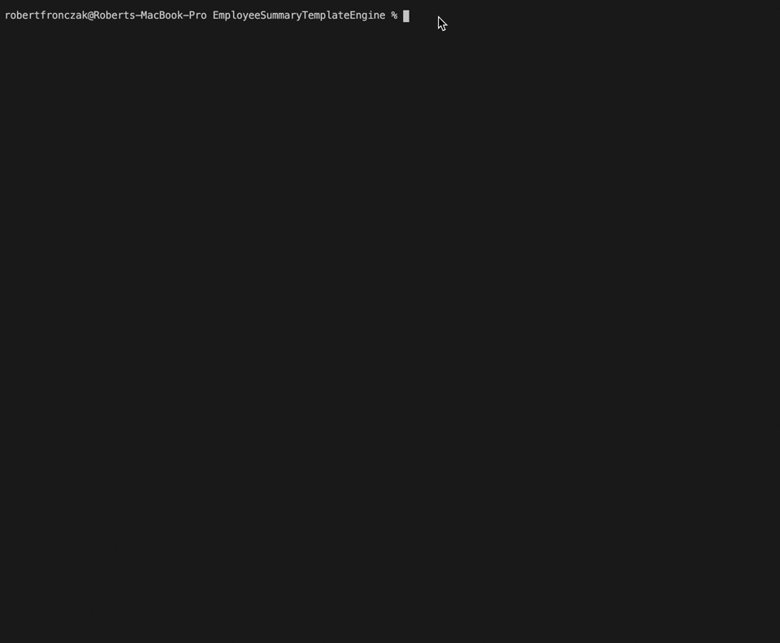

# Employee Summary Template Engine

Command-line application (Node CLI) that creates a formatted roster of a software engineering team. Manager's input answers to a series of quesions dynamically generates a clean html file. Team members consit of a Manager, Engineers and Interns.


```
Run  on comand line as: node app.js

```

### Installing
Download Zip  
 
```
npm 
npm install package.json

```

## Usage
### Prompts for Input:
(Depending on Manager, Engineer and Intern roles)
* Name
* Employee ID
* Email
* GitHub ID
* School
* Office Number

Manager data is completed first. Then user can add multiple Engeneers and Interns. All input data is error checked.  Jest was used for running tests which all passesd. Inquirer is used for collecting input from the user.

 
## Special Features
team.html is dynamically created in output directory. Clean nice ouptut.

### Structure:


### Sample:



## Credits
Inquirer.js:  <a href="https://github.com/SBoudrias/Inquirer.js" target="_blank">SBoudrias</a>

jestjs.io <a href="https://jestjs.io/" target="_blank">jest</a>


## Acknowledgments

* Rutgers Bootcamp Team


